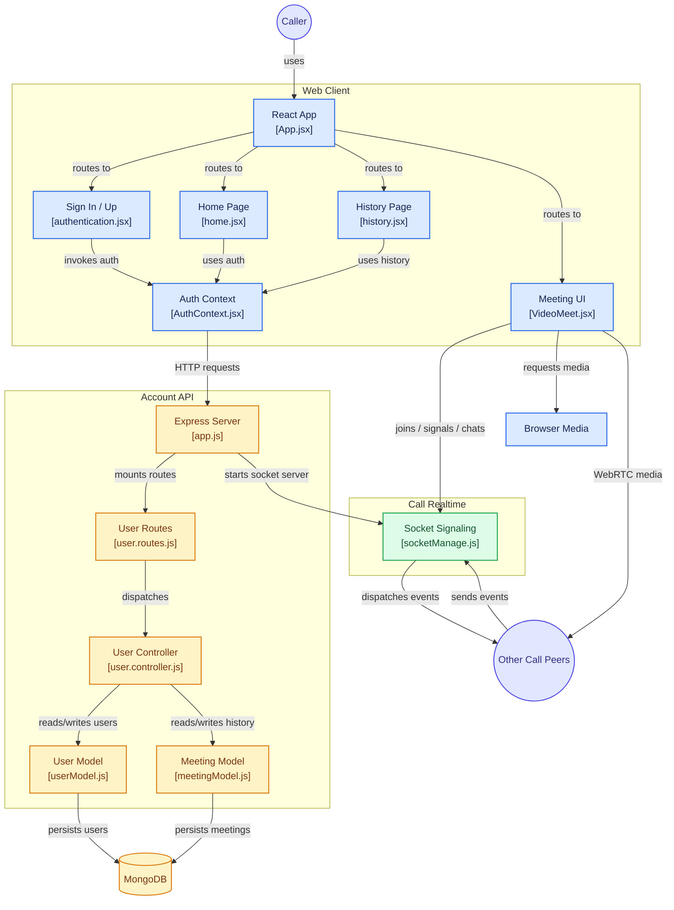

# 🏗️ Video Call App — System Architecture

This document describes the architecture, major components, communication flow, authentication flow, database structure, and real-time video calling flow of the **YRP Video Call** application.

---

## 📌 Architecture Overview

The application is divided into four major parts:

1. **Web Client** — React frontend
2. **Account API** — Express.js backend and authentication
3. **Database** — MongoDB for users and meeting history
4. **Real-Time Call Layer** — Socket.IO signaling + WebRTC media communication



---

# 🖥️ 1. Web Client

The frontend is built using **React**.

The main frontend components are:

| Component      | File                 | Responsibility                       |
| -------------- | -------------------- | ------------------------------------ |
| React App      | `App.jsx`            | Application routing                  |
| Authentication | `authentication.jsx` | Login and registration UI            |
| Auth Context   | `AuthContext.jsx`    | Authentication state and API calls   |
| Home           | `home.jsx`           | Create/join meeting                  |
| History        | `history.jsx`        | Display previous meetings            |
| Meeting UI     | `VideoMeet.jsx`      | Video call, audio, chat and controls |

### Application Flow

```text
User
  ↓
App.jsx
  ↓
Authentication / Home / History / Meeting
```

`App.jsx` works as the main routing layer and decides which page should be displayed.

---

# 🔐 2. Authentication Flow

Authentication is handled through the React authentication context and Express API.

```text
User
  ↓
authentication.jsx
  ↓
AuthContext.jsx
  ↓
HTTP Request
  ↓
Express app.js
  ↓
user.routes.js
  ↓
user.controller.js
  ↓
User Model
  ↓
MongoDB
```

The authentication context maintains the authentication-related state on the frontend and communicates with the backend using HTTP requests.

---

# 🏠 3. Home and Meeting Flow

After authentication, the user can access the home page.

The home page allows the user to:

* Create/join a meeting
* Enter a meeting code
* Navigate to a meeting
* Store meeting activity/history

The basic flow is:

```text
Home Page
    ↓
Meeting Code
    ↓
VideoMeet.jsx
    ↓
Socket.IO Signaling
    ↓
Other Participants
```

---

# 🗄️ 4. Backend Architecture

The backend is built using **Node.js + Express.js**.

The backend follows a basic layered architecture:

```text
Client
   ↓
Express Server
   ↓
Routes
   ↓
Controllers
   ↓
Models
   ↓
MongoDB
```

### Main Backend Files

#### `app.js`

The main backend entry point.

Responsibilities include:

* Creating the Express server
* Configuring middleware
* Connecting to MongoDB
* Mounting API routes
* Starting the HTTP server
* Initializing Socket.IO

---

## `user.routes.js`

Defines the API endpoints related to users.

Routes are forwarded to the appropriate controller functions.

```text
HTTP Request
     ↓
user.routes.js
     ↓
user.controller.js
```

---

## `user.controller.js`

Contains the business logic for user-related operations.

Typical responsibilities include:

* User registration
* User login
* Authentication-related operations
* Adding meeting activity
* Retrieving meeting history

---

# 👤 5. User Model

`userModel.js` defines the MongoDB structure for application users.

Conceptually:

```text
User
 ├── Name
 ├── Username / Email
 ├── Password
 └── Other user information
```

The model is responsible for interacting with the users collection in MongoDB.

---

# 🕒 6. Meeting Model

`meetingModel.js` represents meeting/activity information.

It is used to store meeting-related history so that users can later view their previous meetings.

Conceptually:

```text
Meeting
 ├── User
 ├── Meeting Code
 └── Meeting Information
```

The exact fields depend on the current implementation of the model.

---

# 🍃 7. MongoDB

MongoDB acts as the application's persistent database.

The backend communicates with MongoDB through the Mongoose models.

```text
user.controller.js
        ↓
    userModel.js
        ↓
      MongoDB
```

and:

```text
user.controller.js
        ↓
 meetingModel.js
        ↓
      MongoDB
```

MongoDB stores persistent information such as:

* User accounts
* User-related information
* Meeting history

---

# 🔄 8. Real-Time Communication

Real-time communication is handled using **Socket.IO**.

The Socket.IO server is managed through:

```text
backend/src/controllers/socketManage.js
```

The socket layer is responsible for communication between participants during a meeting.

```text
Participant A
      ↓
 Socket.IO Server
      ↓
Participant B
```

The socket server handles events such as:

* Joining a meeting
* Participant connection
* Participant disconnection
* WebRTC signaling
* Chat messages
* Call-related events

---

# 📹 9. WebRTC Media Communication

The actual audio and video communication uses **WebRTC**.

The browser requests access to the user's:

* Camera
* Microphone

through browser media APIs.

The simplified flow is:

```text
VideoMeet.jsx
      ↓
Browser Media API
      ↓
Camera + Microphone
      ↓
WebRTC Peer Connection
      ↓
Other Participant
```

An important distinction is:

> **Socket.IO is used for signaling, while WebRTC is used for the actual audio/video media communication.**

The media stream does not need to continuously pass through the Express/Socket.IO server.

---

# 💬 10. Chat Communication

The meeting interface also provides real-time chat.

The general flow is:

```text
User A
  ↓
VideoMeet.jsx
  ↓
Socket.IO
  ↓
Socket Server
  ↓
Socket.IO
  ↓
User B
```

This allows participants inside the same meeting room to exchange messages in real time.

---

# 🔌 11. Complete Request Flow

A normal API request follows this architecture:

```text
React Component
      ↓
AuthContext / API Request
      ↓
Express Server
      ↓
Route
      ↓
Controller
      ↓
Mongoose Model
      ↓
MongoDB
      ↓
Response
      ↓
React Component
```

---

# 📹 12. Complete Video Call Flow

The video calling process can be summarized as:

```text
User opens meeting
        ↓
VideoMeet.jsx
        ↓
Join Socket.IO room
        ↓
Discover other participants
        ↓
Exchange WebRTC signaling information
        ↓
Create RTCPeerConnection
        ↓
Exchange ICE candidates
        ↓
Establish peer connection
        ↓
Audio/Video streams
        ↓
Other participant
```

---

# 🧩 13. Technology Architecture

```text
                    YRP VIDEO CALL
                          │
        ┌─────────────────┼─────────────────┐
        │                 │                 │
     Frontend          Backend          Database
        │                 │                 │
      React            Node.js          MongoDB
        │              Express.js
        │                 │
   React Router       Socket.IO
        │                 │
   Material UI       WebRTC Signaling
        │
   Browser Media
        │
   Camera/Microphone
```

---

# 🛠️ 14. Technology Stack

### Frontend

* React
* React Router
* Material UI
* Axios
* Socket.IO Client
* WebRTC
* HTML/CSS

### Backend

* Node.js
* Express.js
* Socket.IO
* Mongoose
* MongoDB
* CORS

### Communication

* HTTP/REST API
* Socket.IO
* WebRTC

### Database

* MongoDB

---

# 📁 15. Important Project Structure

```text
video-call-app/
│
├── frontend/
│   ├── src/
│   │   ├── App.jsx
│   │   ├── contexts/
│   │   │   └── AuthContext.jsx
│   │   ├── pages/
│   │   │   ├── authentication.jsx
│   │   │   ├── home.jsx
│   │   │   ├── history.jsx
│   │   │   └── VideoMeet.jsx
│   │   └── ...
│   │
│   └── package.json
│
├── backend/
│   ├── src/
│   │   ├── app.js
│   │   ├── routes/
│   │   │   └── user.routes.js
│   │   ├── controllers/
│   │   │   ├── user.controller.js
│   │   │   └── socketManage.js
│   │   ├── models/
│   │   │   ├── userModel.js
│   │   │   └── meetingModel.js
│   │   └── ...
│   │
│   └── package.json
│
├── docs/
│   └── architecture.md
│
└── README.md
```

---

# 🔗 16. Important Source Files

The architecture diagram provides direct links to the main implementation files:

### Frontend

* [App.jsx](https://github.com/yrpyash22/video-call-app/blob/main/frontend/src/App.jsx)
* [authentication.jsx](https://github.com/yrpyash22/video-call-app/blob/main/frontend/src/pages/authentication.jsx)
* [AuthContext.jsx](https://github.com/yrpyash22/video-call-app/blob/main/frontend/src/contexts/AuthContext.jsx)
* [home.jsx](https://github.com/yrpyash22/video-call-app/blob/main/frontend/src/pages/home.jsx)
* [history.jsx](https://github.com/yrpyash22/video-call-app/blob/main/frontend/src/pages/history.jsx)
* [VideoMeet.jsx](https://github.com/yrpyash22/video-call-app/blob/main/frontend/src/pages/VideoMeet.jsx)

### Backend

* [app.js](https://github.com/yrpyash22/video-call-app/blob/main/backend/src/app.js)
* [user.routes.js](https://github.com/yrpyash22/video-call-app/blob/main/backend/src/routes/user.routes.js)
* [user.controller.js](https://github.com/yrpyash22/video-call-app/blob/main/backend/src/controllers/user.controller.js)
* [userModel.js](https://github.com/yrpyash22/video-call-app/blob/main/backend/src/models/userModel.js)
* [meetingModel.js](https://github.com/yrpyash22/video-call-app/blob/main/backend/src/models/meetingModel.js)
* [socketManage.js](https://github.com/yrpyash22/video-call-app/blob/main/backend/src/controllers/socketManage.js)

---

# 🎯 17. Architecture Summary

The application combines three major communication mechanisms:

| Mechanism           | Purpose                                               |
| ------------------- | ----------------------------------------------------- |
| **HTTP / REST API** | Authentication and persistent backend operations      |
| **Socket.IO**       | Real-time signaling, room events and chat             |
| **WebRTC**          | Direct audio/video communication between participants |
| **MongoDB**         | Persistent user and meeting data                      |

The overall architecture can therefore be summarized as:

```text
React
 │
 ├── HTTP ────────────► Express ───► MongoDB
 │
 └── Socket.IO ───────► Signaling
                              │
                              ▼
                           WebRTC
                              │
                              ▼
                       Other Participants
```

This separation allows the application to keep **persistent data, API operations, real-time events, and media communication** as distinct responsibilities.
